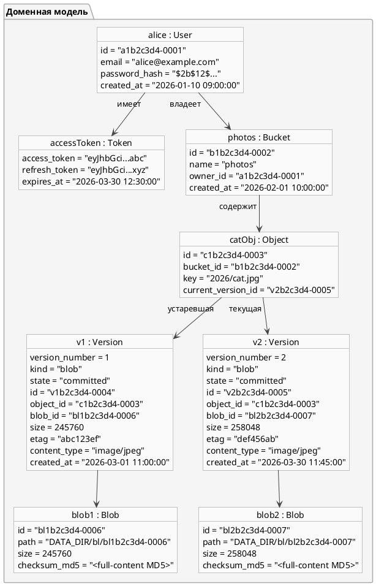

# Пример объектов и версий

**Иллюстративный снимок** после двух записей, не dump текущей БД. Короткие ID,
checksums и JWT — условные обозначения; реальные идентификаторы — UUID.
Object key задаётся относительно bucket. Байтами управляет Storage, версиями —
Metadata; token показан как данные клиента, а не запись Redis session.
Filesystem использует shard из первых двух символов blob ID без `.bin`.

