# Sequence Diagrams v3 — opens3-rebac
# Activation boxes + русские подписи
# Каждый блок @startuml...@enduml вставляй отдельно на plantuml.com

---

## SD-01: Загрузка объекта (PutObject)

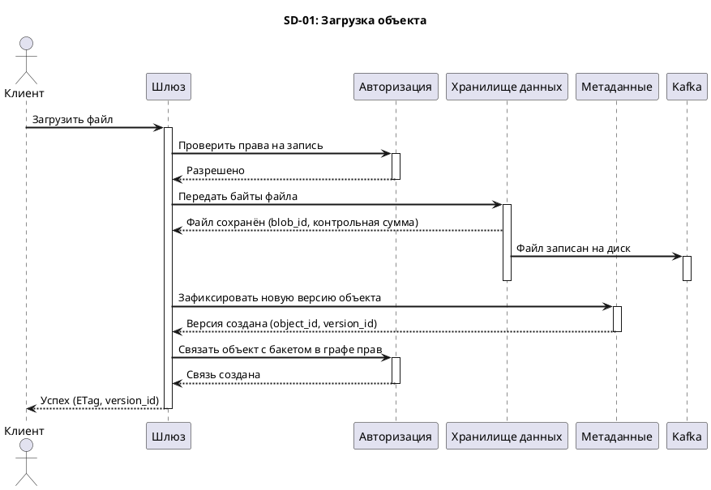

---

## SD-02: Скачивание объекта (GetObject)

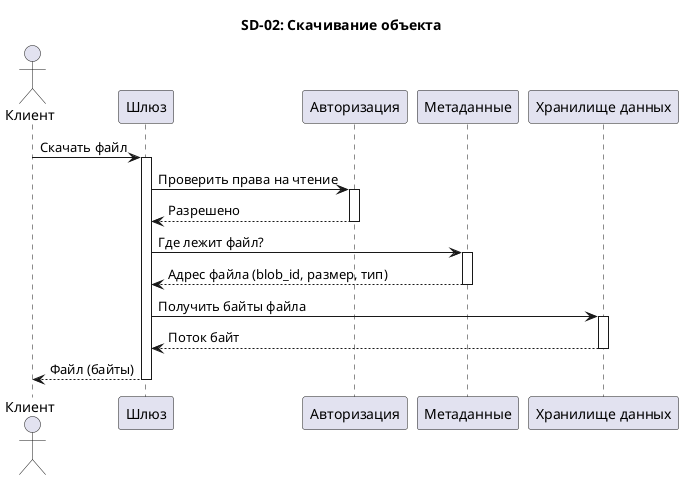

---

## SD-03: Удаление объекта (DeleteObject)

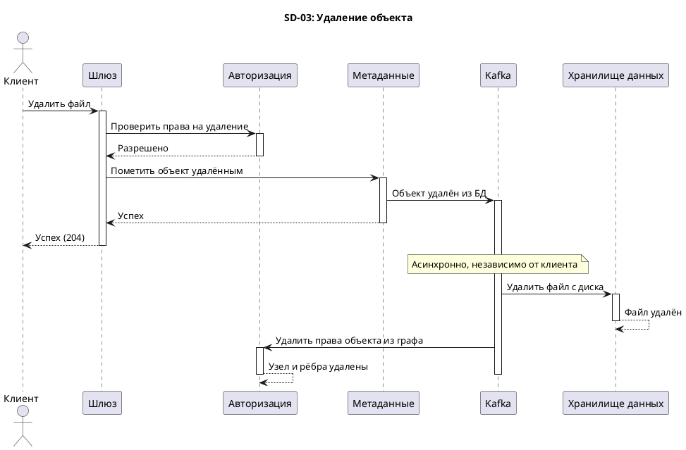

---

## SD-04: Создание бакета (CreateBucket)

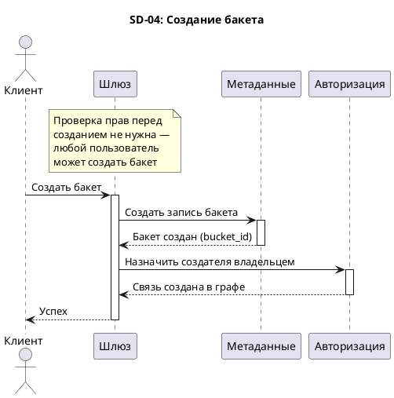

---

## SD-05: Удаление бакета (DeleteBucket)

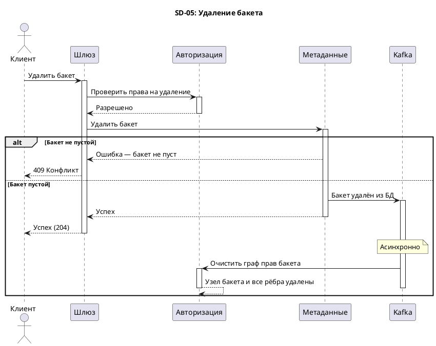

---

## SD-06: Список объектов (ListObjects)

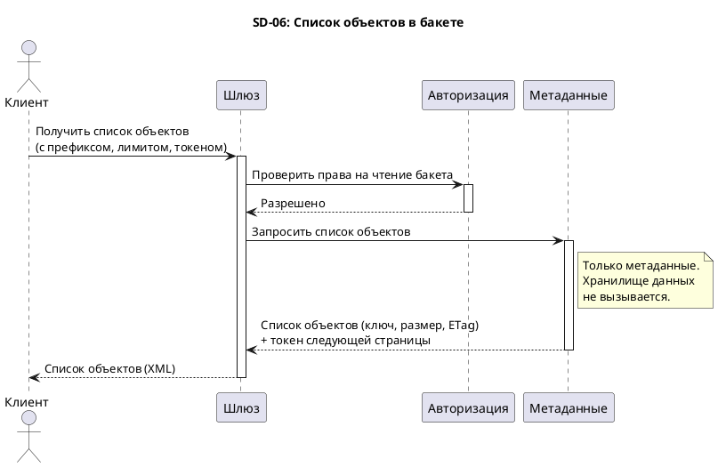

---

## SD-07: Метаданные объекта (HeadObject)

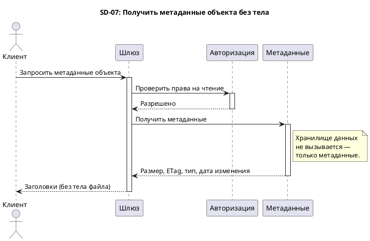

---

## SD-08: Список бакетов (ListBuckets)

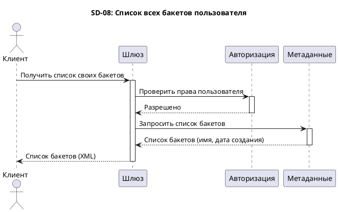

---

## SD-09: Составная загрузка (Multipart Upload)

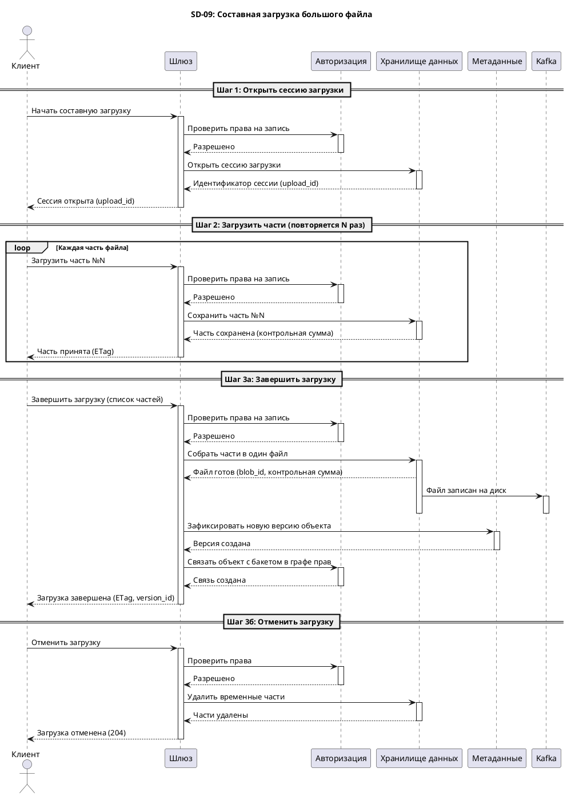

---

## SD-10: Выдача прав доступа

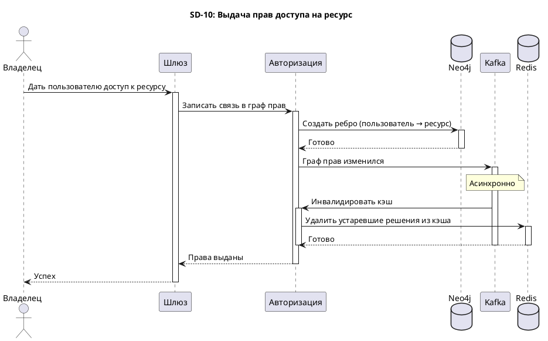

---

## SD-11: Отзыв прав доступа

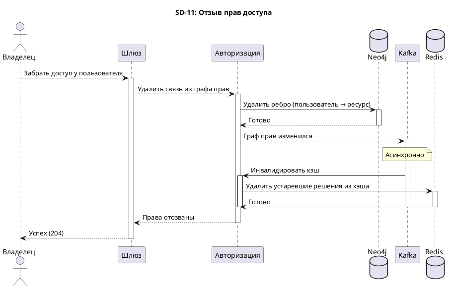

---

## SD-12: Проверка прав (Check — внутренний flow)

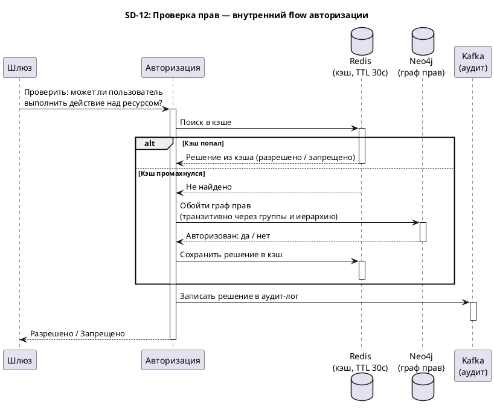

---

## SD-13: Kafka — подтверждение записи файла (object-stored)

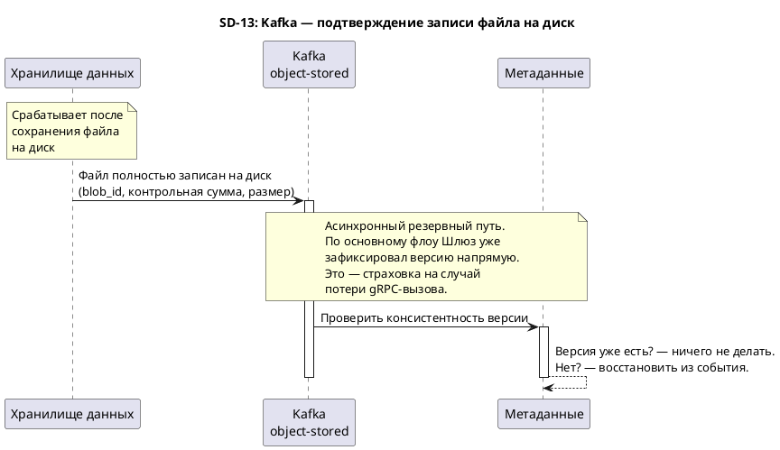

---

## SD-14: Kafka — удаление файла с диска (object-deleted)

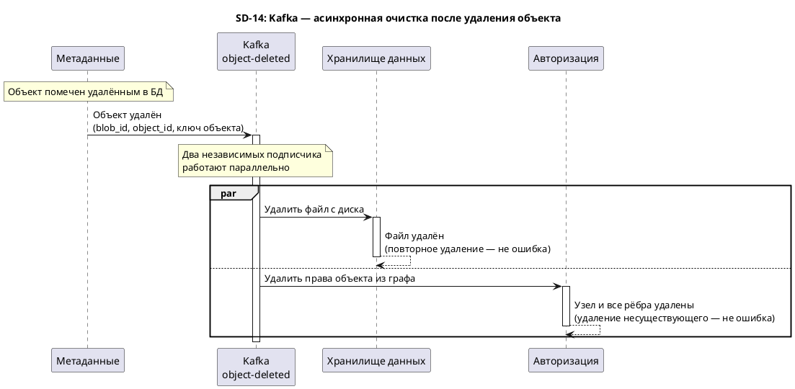

---

## SD-15: Kafka — удаление бакета из графа (bucket-deleted)

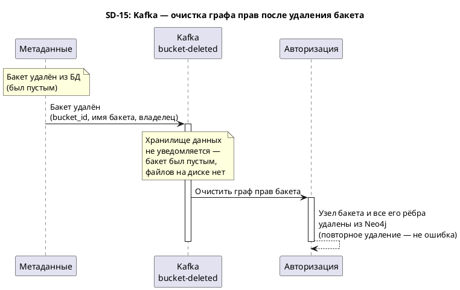

---

## SD-16: Kafka — инвалидация кэша прав (auth-changes)

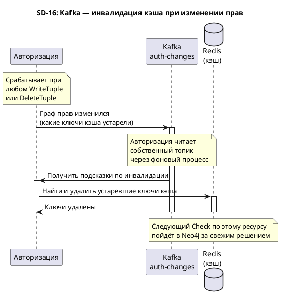
