# Последовательности операций OpenS3-ReBAC

Статус на 11 сентября 2026: **проект Gateway и межсервисных сценариев**.
Gateway и Kafka cleanup consumers отсутствуют. SD-12 описывает текущий AuthZ Check;
SD-16 — отдельный существующий invalidator с ограничениями. Для всех внешних запросов предполагается аутентификация в Gateway. Схемы показывают
успешную ветвь; DENY/ошибки должны завершать запрос до защищённого действия.

Каждый блок PlantUML можно открыть отдельно в локальном PlantUML renderer.
[Политика доступа и события](gateway-contract-plan.md) задаёт проектные решения;
[README сервисов](README.md#сервисы) — реально доступные RPC.
Storage commit ниже означает текущий file sync + rename; power-loss durability
требует дополнительных изменений. Внешний успех следует после видимости Metadata.

---

## SD-01: Загрузка объекта (PutObject)

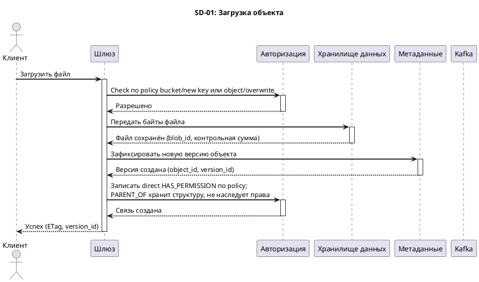
```plantuml
@startuml SD-01-PutObject
title SD-01: Загрузка объекта

skinparam sequenceArrowThickness 2
skinparam sequenceGroupBackgroundColor #F0F4FF
skinparam lifeline.borderColor #555

actor       "Клиент"   as Client
participant "Шлюз"     as GW
participant "Авторизация" as AZ
participant "Хранилище данных" as DN
participant "Метаданные" as MD
participant "Kafka"    as KF

Client -> GW : Загрузить файл
activate GW

GW -> AZ : Check по policy bucket/new key или object/overwrite
activate AZ
AZ --> GW : Разрешено
deactivate AZ

GW -> DN : Передать байты файла
activate DN
DN --> GW : Файл сохранён (blob_id, контрольная сумма)
deactivate DN

GW -> MD : Зафиксировать новую версию объекта
activate MD
MD --> GW : Версия создана (object_id, version_id)
deactivate MD

GW -> AZ : Записать direct HAS_PERMISSION по policy;\nPARENT_OF хранит структуру, не наследует права
activate AZ
AZ --> GW : Связь создана
deactivate AZ

GW --> Client : Успех (ETag, version_id)
deactivate GW

@enduml
```

---

## SD-02: Скачивание объекта (GetObject)

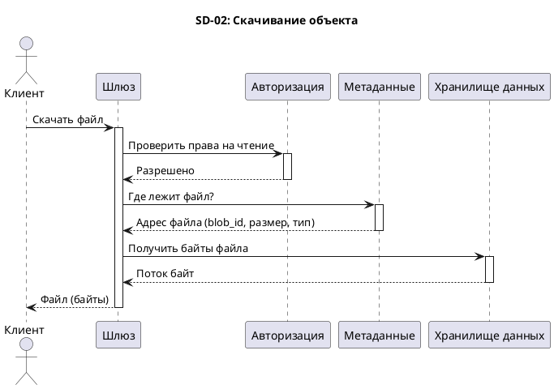
```plantuml
@startuml SD-02-GetObject
title SD-02: Скачивание объекта

actor       "Клиент"   as Client
participant "Шлюз"     as GW
participant "Авторизация" as AZ
participant "Метаданные" as MD
participant "Хранилище данных" as DN

Client -> GW : Скачать файл
activate GW

GW -> AZ : Проверить права на чтение
activate AZ
AZ --> GW : Разрешено
deactivate AZ

GW -> MD : Где лежит файл?
activate MD
MD --> GW : Адрес файла (blob_id, размер, тип)
deactivate MD

GW -> DN : Получить байты файла
activate DN
DN --> GW : Поток байт
deactivate DN

GW --> Client : Файл (байты)
deactivate GW

@enduml
```

---

## SD-03: Удаление объекта (DeleteObject)

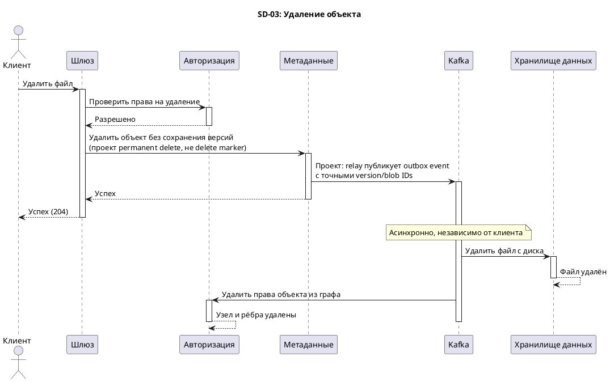
```plantuml
@startuml SD-03-DeleteObject
title SD-03: Удаление объекта

actor       "Клиент"   as Client
participant "Шлюз"     as GW
participant "Авторизация" as AZ
participant "Метаданные" as MD
participant "Kafka"    as KF
participant "Хранилище данных" as DN

Client -> GW : Удалить файл
activate GW

GW -> AZ : Проверить права на удаление
activate AZ
AZ --> GW : Разрешено
deactivate AZ

GW -> MD : Удалить объект без сохранения версий\n(проект permanent delete, не delete marker)
activate MD
MD -> KF : Проект: relay публикует outbox event\nс точными version/blob IDs
activate KF
MD --> GW : Успех
deactivate MD

GW --> Client : Успех (204)
deactivate GW

note over KF : Асинхронно, независимо от клиента

KF -> DN : Удалить файл с диска
activate DN
DN --> DN : Файл удалён
deactivate DN

KF -> AZ : Удалить права объекта из графа
activate AZ
AZ --> AZ : Узел и рёбра удалены
deactivate AZ

deactivate KF

@enduml
```

---

## SD-04: Создание бакета (CreateBucket)

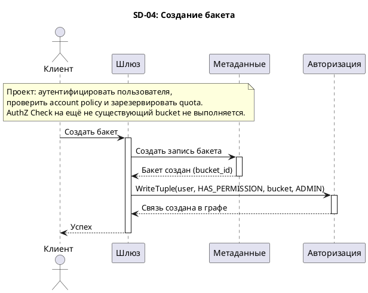
```plantuml
@startuml SD-04-CreateBucket
title SD-04: Создание бакета

actor       "Клиент"   as Client
participant "Шлюз"     as GW
participant "Метаданные" as MD
participant "Авторизация" as AZ

note over GW : Проект: аутентифицировать пользователя,\nпроверить account policy и зарезервировать quota.\nAuthZ Check на ещё не существующий bucket не выполняется.

Client -> GW : Создать бакет
activate GW

GW -> MD : Создать запись бакета
activate MD
MD --> GW : Бакет создан (bucket_id)
deactivate MD

GW -> AZ : WriteTuple(user, HAS_PERMISSION, bucket, ADMIN)
activate AZ
AZ --> GW : Связь создана в графе
deactivate AZ

GW --> Client : Успех
deactivate GW

@enduml
```

---

## SD-05: Удаление бакета (DeleteBucket)

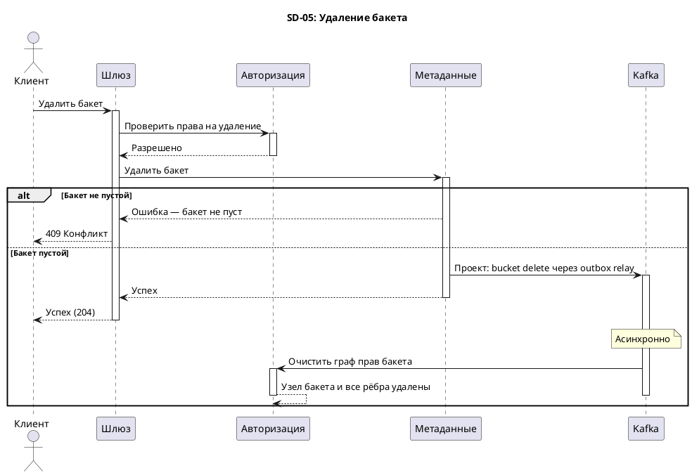
```plantuml
@startuml SD-05-DeleteBucket
title SD-05: Удаление бакета

actor       "Клиент"   as Client
participant "Шлюз"     as GW
participant "Авторизация" as AZ
participant "Метаданные" as MD
participant "Kafka"    as KF

Client -> GW : Удалить бакет
activate GW

GW -> AZ : Проверить права на удаление
activate AZ
AZ --> GW : Разрешено
deactivate AZ

GW -> MD : Удалить бакет
activate MD

alt Бакет не пустой
  MD --> GW : Ошибка — бакет не пуст
  GW --> Client : 409 Конфликт
else Бакет пустой
  MD -> KF : Проект: bucket delete через outbox relay
  activate KF
  MD --> GW : Успех
  deactivate MD
  GW --> Client : Успех (204)
  deactivate GW

  note over KF : Асинхронно
  KF -> AZ : Очистить граф прав бакета
  activate AZ
  AZ --> AZ : Узел бакета и все рёбра удалены
  deactivate AZ
  deactivate KF
end

@enduml
```

---

## SD-06: Список объектов (ListObjects)

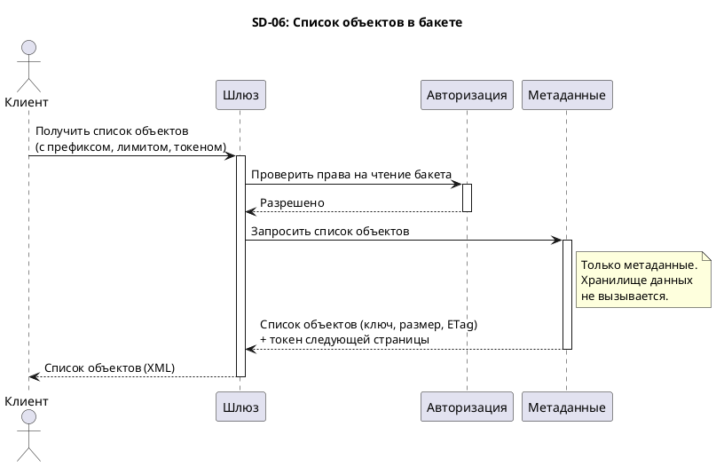
```plantuml
@startuml SD-06-ListObjects
title SD-06: Список объектов в бакете

actor       "Клиент"   as Client
participant "Шлюз"     as GW
participant "Авторизация" as AZ
participant "Метаданные" as MD

Client -> GW : Получить список объектов\n(с префиксом, лимитом, токеном)
activate GW

GW -> AZ : Проверить права на чтение бакета
activate AZ
AZ --> GW : Разрешено
deactivate AZ

GW -> MD : Запросить список объектов
activate MD
note right of MD : Только метаданные.\nХранилище данных\nне вызывается.
MD --> GW : Список объектов (ключ, размер, ETag)\n+ токен следующей страницы
deactivate MD

GW --> Client : Список объектов (XML)
deactivate GW

@enduml
```

---

## SD-07: Метаданные объекта (HeadObject)

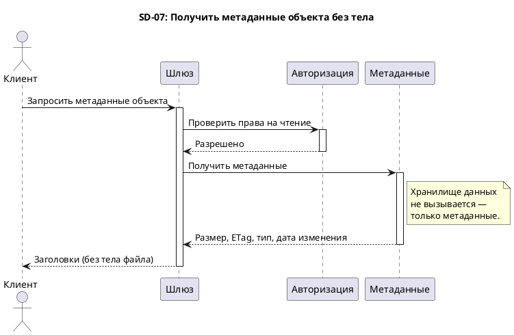
```plantuml
@startuml SD-07-HeadObject
title SD-07: Получить метаданные объекта без тела

actor       "Клиент"   as Client
participant "Шлюз"     as GW
participant "Авторизация" as AZ
participant "Метаданные" as MD

Client -> GW : Запросить метаданные объекта
activate GW

GW -> AZ : Проверить права на чтение
activate AZ
AZ --> GW : Разрешено
deactivate AZ

GW -> MD : Получить метаданные
activate MD
note right of MD : Хранилище данных\nне вызывается —\nтолько метаданные.
MD --> GW : Размер, ETag, тип, дата изменения
deactivate MD

GW --> Client : Заголовки (без тела файла)
deactivate GW

@enduml
```

---

## SD-08: Список бакетов (ListBuckets)

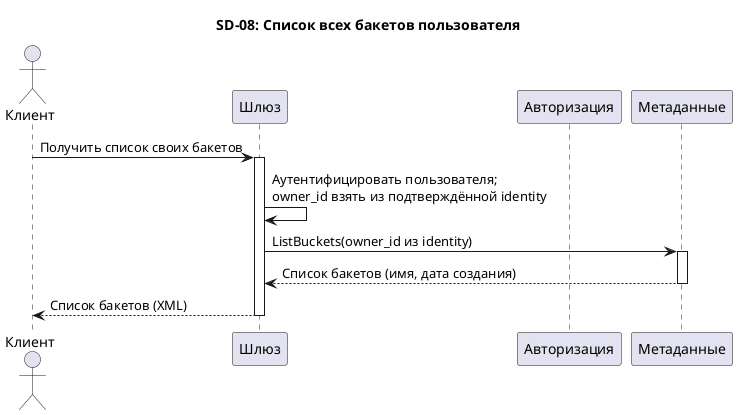
```plantuml
@startuml SD-08-ListBuckets
title SD-08: Список всех бакетов пользователя

actor       "Клиент"   as Client
participant "Шлюз"     as GW
participant "Авторизация" as AZ
participant "Метаданные" as MD

Client -> GW : Получить список своих бакетов
activate GW

GW -> GW : Аутентифицировать пользователя;\nowner_id взять из подтверждённой identity

GW -> MD : ListBuckets(owner_id из identity)
activate MD
MD --> GW : Список бакетов (имя, дата создания)
deactivate MD

GW --> Client : Список бакетов (XML)
deactivate GW

@enduml
```

---

## SD-09: Составная загрузка (Multipart Upload)

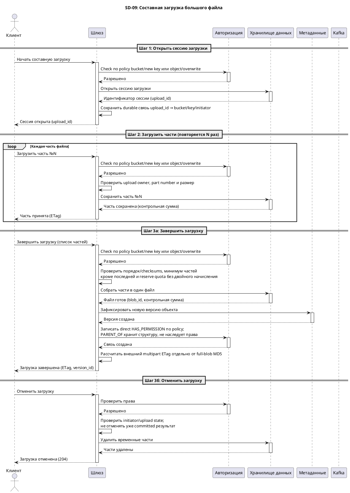
```plantuml
@startuml SD-09-MultipartUpload
title SD-09: Составная загрузка большого файла

actor       "Клиент"   as Client
participant "Шлюз"     as GW
participant "Авторизация" as AZ
participant "Хранилище данных" as DN
participant "Метаданные" as MD
participant "Kafka"    as KF

== Шаг 1: Открыть сессию загрузки ==

Client -> GW : Начать составную загрузку
activate GW
GW -> AZ : Check по policy bucket/new key или object/overwrite
activate AZ
AZ --> GW : Разрешено
deactivate AZ
GW -> DN : Открыть сессию загрузки
activate DN
DN --> GW : Идентификатор сессии (upload_id)
deactivate DN
GW -> GW : Сохранить durable связь upload_id → bucket/key/initiator
GW --> Client : Сессия открыта (upload_id)
deactivate GW

== Шаг 2: Загрузить части (повторяется N раз) ==

loop Каждая часть файла
  Client -> GW : Загрузить часть №N
  activate GW
  GW -> AZ : Check по policy bucket/new key или object/overwrite
  activate AZ
  AZ --> GW : Разрешено
  deactivate AZ
  GW -> GW : Проверить upload owner, part number и размер
  GW -> DN : Сохранить часть №N
  activate DN
  DN --> GW : Часть сохранена (контрольная сумма)
  deactivate DN
  GW --> Client : Часть принята (ETag)
  deactivate GW
end

== Шаг 3а: Завершить загрузку ==

Client -> GW : Завершить загрузку (список частей)
activate GW
GW -> AZ : Check по policy bucket/new key или object/overwrite
activate AZ
AZ --> GW : Разрешено
deactivate AZ
GW -> GW : Проверить порядок/checksums, минимум частей\nкроме последней и reserve quota без двойного начисления
GW -> DN : Собрать части в один файл
activate DN
DN --> GW : Файл готов (blob_id, контрольная сумма)
deactivate DN
GW -> MD : Зафиксировать новую версию объекта
activate MD
MD --> GW : Версия создана
deactivate MD
GW -> AZ : Записать direct HAS_PERMISSION по policy;\nPARENT_OF хранит структуру, не наследует права
activate AZ
AZ --> GW : Связь создана
deactivate AZ
GW -> GW : Рассчитать внешний multipart ETag отдельно от full-blob MD5
GW --> Client : Загрузка завершена (ETag, version_id)
deactivate GW

== Шаг 3б: Отменить загрузку ==

Client -> GW : Отменить загрузку
activate GW
GW -> AZ : Проверить права
activate AZ
AZ --> GW : Разрешено
deactivate AZ
GW -> GW : Проверить initiator/upload state;\nне отменять уже committed результат
GW -> DN : Удалить временные части
activate DN
DN --> GW : Части удалены
deactivate DN
GW --> Client : Загрузка отменена (204)
deactivate GW

@enduml
```

---

## SD-10: Выдача прав доступа

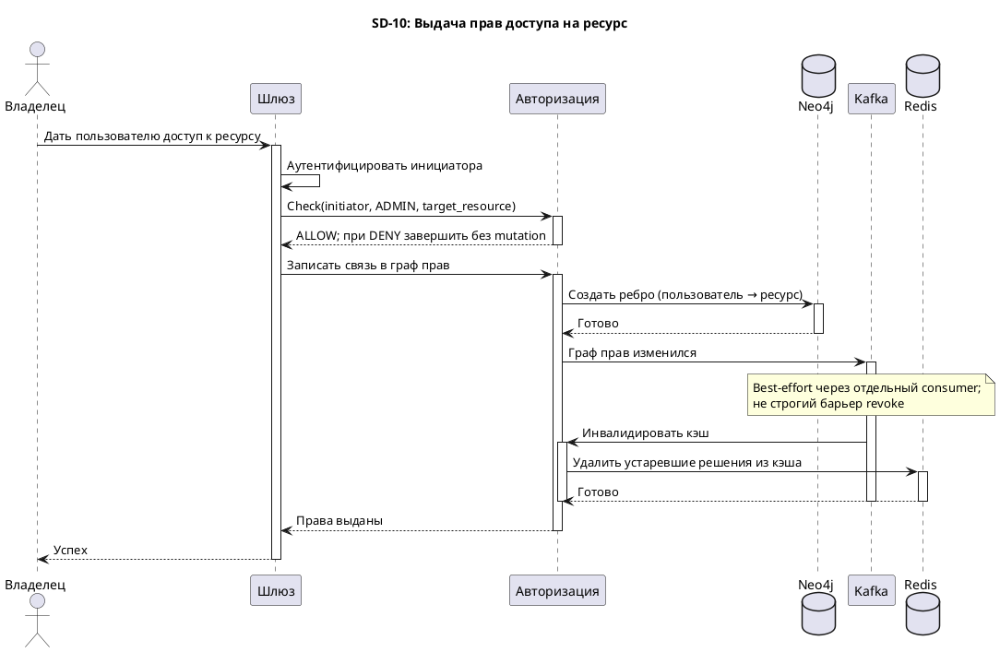
```plantuml
@startuml SD-10-GrantAccess
title SD-10: Выдача прав доступа на ресурс

actor       "Владелец" as Admin
participant "Шлюз"     as GW
participant "Авторизация" as AZ
database    "Neo4j"    as N4
participant "Kafka"    as KF
database    "Redis"    as RD

Admin -> GW : Дать пользователю доступ к ресурсу
activate GW

GW -> GW : Аутентифицировать инициатора
GW -> AZ : Check(initiator, ADMIN, target_resource)
activate AZ
AZ --> GW : ALLOW; при DENY завершить без mutation
deactivate AZ

GW -> AZ : Записать связь в граф прав
activate AZ

AZ -> N4 : Создать ребро (пользователь → ресурс)
activate N4
N4 --> AZ : Готово
deactivate N4

AZ -> KF : Граф прав изменился
activate KF

note over KF : Best-effort через отдельный consumer;\nне строгий барьер revoke
KF -> AZ : Инвалидировать кэш
activate AZ
AZ -> RD : Удалить устаревшие решения из кэша
activate RD
RD --> AZ : Готово
deactivate RD
deactivate AZ
deactivate KF

AZ --> GW : Права выданы
deactivate AZ

GW --> Admin : Успех
deactivate GW

@enduml
```

---

## SD-11: Отзыв прав доступа

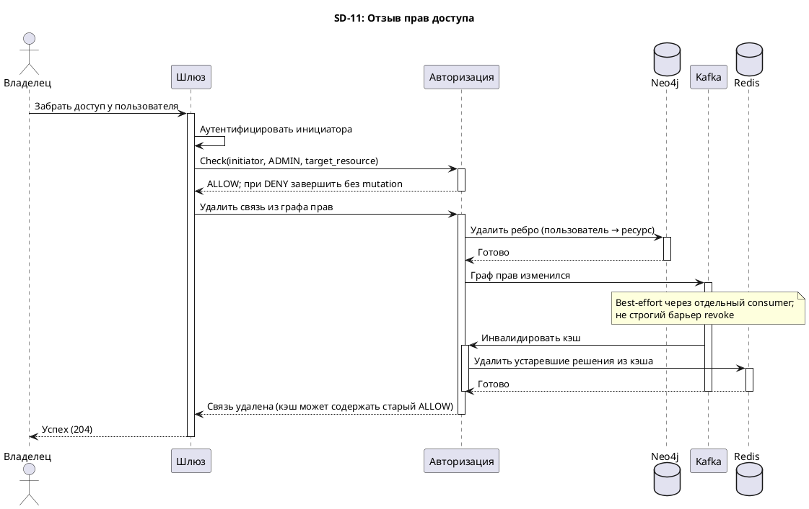
```plantuml
@startuml SD-11-RevokeAccess
title SD-11: Отзыв прав доступа

actor       "Владелец" as Admin
participant "Шлюз"     as GW
participant "Авторизация" as AZ
database    "Neo4j"    as N4
participant "Kafka"    as KF
database    "Redis"    as RD

Admin -> GW : Забрать доступ у пользователя
activate GW

GW -> GW : Аутентифицировать инициатора
GW -> AZ : Check(initiator, ADMIN, target_resource)
activate AZ
AZ --> GW : ALLOW; при DENY завершить без mutation
deactivate AZ

GW -> AZ : Удалить связь из графа прав
activate AZ

AZ -> N4 : Удалить ребро (пользователь → ресурс)
activate N4
N4 --> AZ : Готово
deactivate N4

AZ -> KF : Граф прав изменился
activate KF

note over KF : Best-effort через отдельный consumer;\nне строгий барьер revoke
KF -> AZ : Инвалидировать кэш
activate AZ
AZ -> RD : Удалить устаревшие решения из кэша
activate RD
RD --> AZ : Готово
deactivate RD
deactivate AZ
deactivate KF

AZ --> GW : Связь удалена (кэш может содержать старый ALLOW)
deactivate AZ

GW --> Admin : Успех (204)
deactivate GW

@enduml
```

---

## SD-12: Проверка прав (Check — внутренний flow)

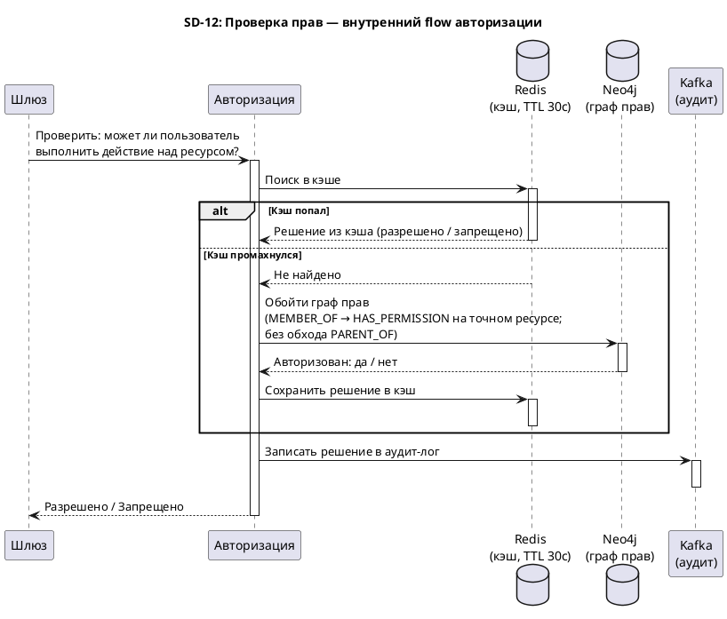
```plantuml
@startuml SD-12-CheckPermission
title SD-12: Проверка прав — внутренний flow авторизации

participant "Шлюз"     as GW
participant "Авторизация" as AZ
database    "Redis\n(кэш, TTL 30с)" as RD
database    "Neo4j\n(граф прав)"    as N4
participant "Kafka\n(аудит)"        as KF

GW -> AZ : Проверить: может ли пользователь\nвыполнить действие над ресурсом?
activate AZ

AZ -> RD : Поиск в кэше
activate RD

alt Кэш попал
  RD --> AZ : Решение из кэша (разрешено / запрещено)
  deactivate RD
else Кэш промахнулся
  RD --> AZ : Не найдено
  deactivate RD
  AZ -> N4 : Обойти граф прав\n(MEMBER_OF → HAS_PERMISSION на точном ресурсе;\nбез обхода PARENT_OF)
  activate N4
  N4 --> AZ : Авторизован: да / нет
  deactivate N4
  AZ -> RD : Сохранить решение в кэш
  activate RD
  deactivate RD
end

AZ -> KF : Записать решение в аудит-лог
activate KF
deactivate KF

AZ --> GW : Разрешено / Запрещено
deactivate AZ

@enduml
```

---

## SD-13: Kafka — подтверждение записи файла (object-stored)

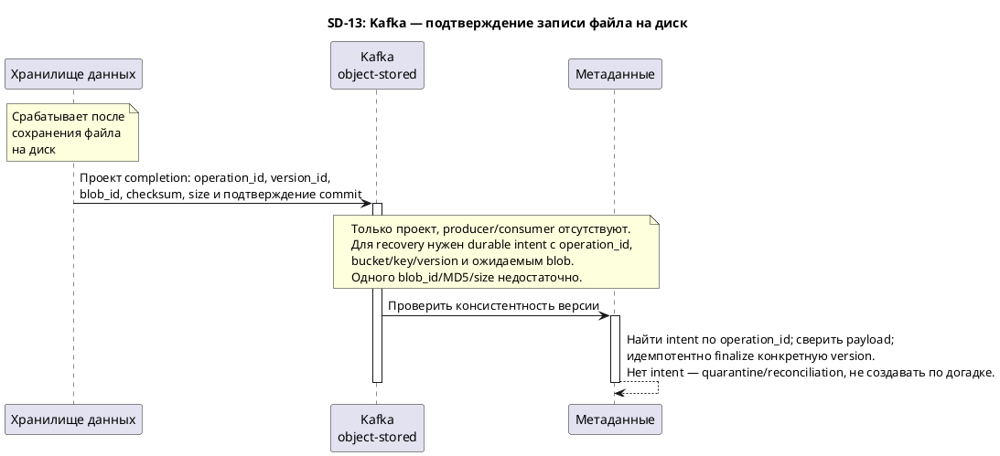
```plantuml
@startuml SD-13-KafkaObjectStored
title SD-13: Kafka — подтверждение записи файла на диск

participant "Хранилище данных" as DN
participant "Kafka\nobject-stored" as KF
participant "Метаданные" as MD

note over DN : Срабатывает после\nсохранения файла\nна диск

DN -> KF : Проект completion: operation_id, version_id,\nblob_id, checksum, size и подтверждение commit
activate KF

note over KF, MD : Только проект, producer/consumer отсутствуют.\nДля recovery нужен durable intent с operation_id,\nbucket/key/version и ожидаемым blob.\nОдного blob_id/MD5/size недостаточно.

KF -> MD : Проверить консистентность версии
activate MD
MD --> MD : Найти intent по operation_id; сверить payload;\nидемпотентно finalize конкретную version.\nНет intent — quarantine/reconciliation, не создавать по догадке.
deactivate MD
deactivate KF

@enduml
```

---

## SD-14: Kafka — удаление файла с диска (object-deleted)

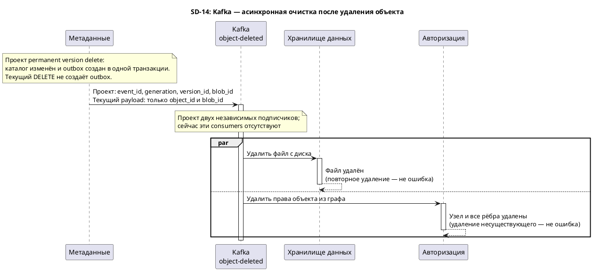
```plantuml
@startuml SD-14-KafkaObjectDeleted
title SD-14: Kafka — асинхронная очистка после удаления объекта

participant "Метаданные" as MD
participant "Kafka\nobject-deleted" as KF
participant "Хранилище данных" as DN
participant "Авторизация" as AZ

note over MD : Проект permanent version delete:\nкаталог изменён и outbox создан в одной транзакции.\nТекущий DELETE не создаёт outbox.

MD -> KF : Проект: event_id, generation, version_id, blob_id\nТекущий payload: только object_id и blob_id
activate KF

note over KF : Проект двух независимых подписчиков;\nсейчас эти consumers отсутствуют

par
  KF -> DN : Удалить файл с диска
  activate DN
  DN --> DN : Файл удалён\n(повторное удаление — не ошибка)
  deactivate DN
else
  KF -> AZ : Удалить права объекта из графа
  activate AZ
  AZ --> AZ : Узел и все рёбра удалены\n(удаление несуществующего — не ошибка)
  deactivate AZ
end

deactivate KF

@enduml
```

---

## SD-15: Kafka — удаление бакета из графа (bucket-deleted)

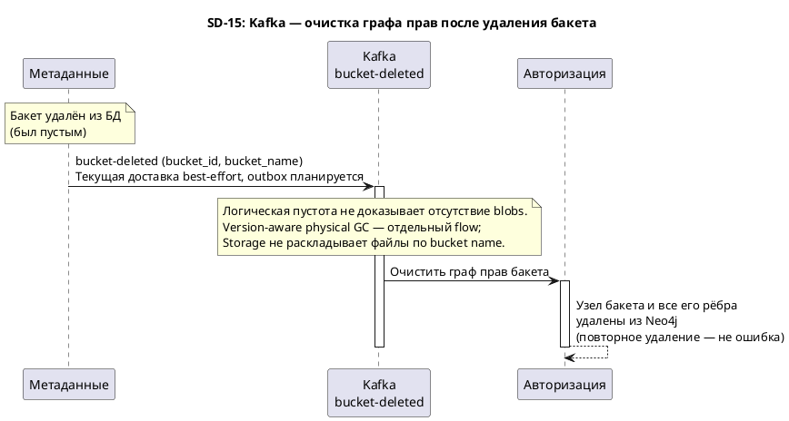
```plantuml
@startuml SD-15-KafkaBucketDeleted
title SD-15: Kafka — очистка графа прав после удаления бакета

participant "Метаданные" as MD
participant "Kafka\nbucket-deleted" as KF
participant "Авторизация" as AZ

note over MD : Бакет удалён из БД\n(был пустым)

MD -> KF : bucket-deleted (bucket_id, bucket_name)\nТекущая доставка best-effort, outbox планируется
activate KF

note over KF : Логическая пустота не доказывает отсутствие blobs.\nVersion-aware physical GC — отдельный flow;\nStorage не раскладывает файлы по bucket name.

KF -> AZ : Очистить граф прав бакета
activate AZ
AZ --> AZ : Узел бакета и все его рёбра\nудалены из Neo4j\n(повторное удаление — не ошибка)
deactivate AZ

deactivate KF

@enduml
```

---

## SD-16: Kafka — инвалидация кэша прав (auth-changes)

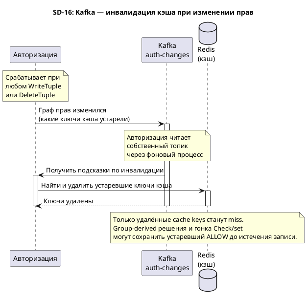
```plantuml
@startuml SD-16-KafkaAuthChanges
title SD-16: Kafka — инвалидация кэша при изменении прав

participant "Авторизация" as AZ
participant "Kafka\nauth-changes" as KF
database    "Redis\n(кэш)"       as RD

note over AZ : Срабатывает при\nлюбом WriteTuple\nили DeleteTuple

AZ -> KF : Граф прав изменился\n(какие ключи кэша устарели)
activate KF

note over KF : Авторизация читает\nсобственный топик\nчерез фоновый процесс

KF -> AZ : Получить подсказки по инвалидации
activate AZ
AZ -> RD : Найти и удалить устаревшие ключи кэша
activate RD
RD --> AZ : Ключи удалены
deactivate RD
deactivate AZ

deactivate KF

note over RD : Только удалённые cache keys станут miss.\nGroup-derived решения и гонка Check/set\nмогут сохранить устаревший ALLOW до истечения записи.

@enduml
```
