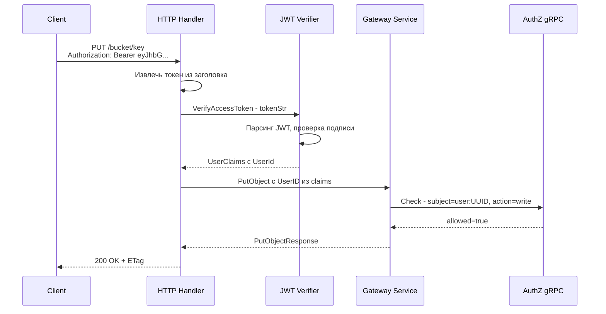
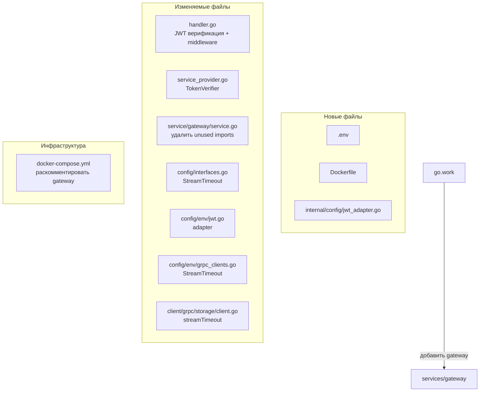

# План исправлений Gateway сервиса

## Обзор

Gateway сервис создан (~20 файлов), но содержит ряд критичных проблем, которые не позволят ему скомпилироваться и корректно работать. Ниже — полный план исправлений, сгруппированный по приоритету.

---

## 🔴 Фаза 1: Ошибки компиляции (не соберётся без исправлений)

### 1.1 Неиспользуемые импорты в `service/gateway/service.go`

**Файл:** `services/gateway/internal/service/gateway/service.go`

**Проблема:** Импортированы `"bytes"` и `"errors"`, но:
- `"bytes"` используется только в функции `cloneBuffer()` (строка 537), которая нигде не вызывается
- `"errors"` импортирован, но все ошибки обрабатываются через `domainerrors` и `fmt`

**Решение:**
- Удалить импорт `"bytes"` (строка 4)
- Удалить импорт `"errors"` (строка 6)
- Удалить неиспользуемую функцию `cloneBuffer()` (строки 537-541)

### 1.2 Неиспользуемые импорты в `handler/http/gateway/handler.go`

**Файл:** `services/gateway/internal/handler/http/gateway/handler.go`

**Проблема:** Импортирован `"mime"` (строка 10), который используется только в функции `detectContentType()` (строка 580), но сама функция нигде не вызывается.

**Решение:**
- Удалить импорт `"mime"` (строка 10)
- Удалить неиспользуемую функцию `detectContentType()` (строки 580-590)

### 1.3 Gateway не добавлен в `go.work`

**Файл:** `go.work`

**Проблема:** Корневой `go.work` не содержит `./services/gateway`, поэтому Go workspace не видит модуль.

**Решение:** Добавить `./services/gateway` в секцию `use`:
```go
use (
    ./services/auth
    ./services/gateway   // <-- добавить
    ./services/storage
    ./services/users
    ./shared
)
```

### 1.4 Отсутствует `go.sum`

**Файл:** `services/gateway/go.sum`

**Проблема:** Файл `go.sum` не сгенерирован, без него `go build` не работает.

**Решение:** Выполнить `cd services/gateway && go mod tidy` после установки Go.

---

## 🔴 Фаза 2: Критичная бизнес-логика (работать будет неправильно)

### 2.1 JWT-верификация: `extractBearerUserID` возвращает сырой токен вместо user_id

**Файл:** `services/gateway/internal/handler/http/gateway/handler.go`, строки 482-492

**Проблема:** Функция `extractBearerUserID` просто извлекает строку после `"Bearer "` и возвращает её как `userID`. По архитектуре проекта Gateway должен:
1. Извлечь JWT-токен из заголовка `Authorization: Bearer <token>`
2. Верифицировать токен через `shared/pkg/go-kit/tokens/jwt.JWTVerifier`
3. Извлечь `UserClaims.UserId` как `user_id`

**Текущий код:**
```go
func extractBearerUserID(r *http.Request) (string, error) {
    // ... парсит "Bearer <token>"
    return strings.TrimSpace(parts[1]), nil  // возвращает ТОКЕН, а не user_id!
}
```

**Решение:**
- Добавить `tokens.TokenVerifier` в `Handler` struct
- Изменить `NewHandler` для приёма `TokenVerifier`
- Переписать `extractBearerUserID` → `extractUserID(r, verifier)`:

```go
type Handler struct {
    service       service.GatewayService
    maxUploadSize int64
    verifier      tokens.TokenVerifier
    router        chi.Router
}

func NewHandler(service service.GatewayService, maxUploadSize int64, verifier tokens.TokenVerifier) *Handler { ... }

func (h *Handler) extractUserID(r *http.Request) (string, error) {
    authorization := r.Header.Get("Authorization")
    // ... парсинг Bearer ...
    tokenStr := strings.TrimSpace(parts[1])
    claims, err := h.verifier.VerifyAccessToken(r.Context(), tokenStr)
    if err != nil {
        return "", domainerrors.ErrUnauthorized
    }
    return claims.UserId, nil
}
```

### 2.2 JWTConfig неполный — не совместим с `JWTConfigVerifier`

**Файлы:**
- `services/gateway/internal/config/interfaces.go` (строки 49-51)
- `services/gateway/internal/config/env/jwt.go`

**Проблема:** Shared `JWTConfigVerifier` требует два метода:
```go
type JWTConfigVerifier interface {
    RefreshTokenSecretKey() string
    AccessTokenSecretKey() string
}
```

Текущий `JWTConfig` Gateway имеет только `AccessTokenSecretKey()`. Gateway не генерирует токены, но `JWTConfigVerifier` требует оба метода.

**Решение:** Два варианта:

**Вариант A (рекомендуемый):** Создать адаптер, который реализует `JWTConfigVerifier`, возвращая пустую строку для `RefreshTokenSecretKey`:
```go
// internal/config/jwt_adapter.go
type jwtVerifierAdapter struct {
    cfg JWTConfig
}

func (a *jwtVerifierAdapter) AccessTokenSecretKey() string  { return a.cfg.AccessTokenSecretKey() }
func (a *jwtVerifierAdapter) RefreshTokenSecretKey() string { return "" }
```

**Вариант B:** Расширить `JWTConfig` интерфейс и env-конфиг, добавив `RefreshTokenSecretKey` (но Gateway не нужен refresh token).

### 2.3 Интеграция JWT verifier в service_provider.go

**Файл:** `services/gateway/internal/app/service_provider.go`

**Проблема:** `serviceProvider` не создаёт `TokenVerifier` и не передаёт его в `Handler`.

**Решение:**
```go
type serviceProvider struct {
    // ... существующие поля ...
    tokenVerifier tokens.TokenVerifier
}

func (s *serviceProvider) TokenVerifier() tokens.TokenVerifier {
    if s.tokenVerifier == nil {
        adapter := &jwtVerifierAdapter{cfg: config.AppConfig().JWT}
        s.tokenVerifier = jwtpkg.NewJWTVerifier(adapter)
    }
    return s.tokenVerifier
}

func (s *serviceProvider) HTTPHandler(ctx context.Context) *httpgateway.Handler {
    if s.httpHandler == nil {
        s.httpHandler = httpgateway.NewHandler(
            s.GatewayService(ctx),
            config.AppConfig().HTTP.MaxUploadSizeBytes(),
            s.TokenVerifier(),  // <-- добавить
        )
    }
    return s.httpHandler
}
```

### 2.4 Streaming timeout для больших файлов

**Файл:** `services/gateway/internal/client/grpc/storage/client.go`

**Проблема:** Все streaming-операции (`StoreObject`, `RetrieveObject`, `UploadPart`) используют `context.WithTimeout(ctx, c.timeout)` с дефолтным `5s`. Для файлов до 5GB это приведёт к `context deadline exceeded`.

**Решение:** Добавить отдельный `streamTimeout` в storage client:

```go
type client struct {
    client        storagev1.DataStorageServiceClient
    timeout       time.Duration
    streamTimeout time.Duration  // для streaming операций
}

func NewClient(c storagev1.DataStorageServiceClient, timeout, streamTimeout time.Duration) grpcclient.StorageClient { ... }
```

Для streaming-операций использовать `streamTimeout` (дефолт: 30 минут), для обычных — `timeout` (5s).

**Изменения в конфиге:**
- Добавить `STORAGE_STREAM_TIMEOUT` env var в `grpc_clients.go`
- Добавить `StreamTimeout() time.Duration` в `GRPCClientConfig` интерфейс (или создать отдельный `StorageClientConfig`)
- Обновить `service_provider.go` для передачи обоих таймаутов

---

## 🟡 Фаза 3: Инфраструктура (нужно для запуска)

### 3.1 Создать `.env` файл

**Файл:** `services/gateway/.env`

```env
# HTTP
HTTP_HOST=0.0.0.0
HTTP_PORT=8080
HTTP_READ_TIMEOUT=15s
HTTP_WRITE_TIMEOUT=30s
HTTP_IDLE_TIMEOUT=60s
HTTP_SHUTDOWN_TIMEOUT=10s
MAX_UPLOAD_SIZE_BYTES=5368709120

# Logger
LOGGER_LEVEL=info
LOGGER_AS_JSON=true
LOGGER_ENABLE_OLTP=true

# OTEL
OTEL_SERVICE_NAME=gateway
OTEL_SERVICE_VERSION=0.1.0
OTEL_ENVIRONMENT=local
OTEL_EXPORTER_OTLP_ENDPOINT=otel-collector:4317
OTEL_METRICS_PUSH_TIMEOUT=10s

# Rate Limiter
RATE_LIMITER_LIMIT=100
RATE_LIMITER_PERIOD=1s

# gRPC Clients
AUTHZ_GRPC_ADDR=authz:50051
METADATA_GRPC_ADDR=metadata:50052
STORAGE_GRPC_ADDR=storage:50053
GRPC_TIMEOUT_MS=5s

# JWT
JWT_SECRET=your-secret-key-here
```

### 3.2 Создать Dockerfile

**Файл:** `services/gateway/Dockerfile`

По образцу существующих сервисов (multi-stage build):
```dockerfile
FROM golang:1.24-alpine AS builder
WORKDIR /app
COPY shared/ shared/
COPY services/gateway/ services/gateway/
COPY go.work go.work.sum ./
RUN cd services/gateway && go mod download && CGO_ENABLED=0 go build -o /gateway ./cmd/server

FROM alpine:3.21
RUN apk add --no-cache ca-certificates
COPY --from=builder /gateway /gateway
ENTRYPOINT ["/gateway"]
```

### 3.3 Раскомментировать Gateway в docker-compose.yml

**Файл:** `docker-compose.yml`, строки 243-245

Заменить закомментированный блок на полную конфигурацию:
```yaml
gateway:
  profiles: [services]
  build:
    context: .
    dockerfile: services/gateway/Dockerfile
  ports:
    - "8080:8080"
  env_file:
    - services/gateway/.env
  networks:
    - opens3-network
  depends_on:
    authz:
      condition: service_healthy
    storage:
      condition: service_healthy
  restart: unless-stopped
  healthcheck:
    test: ["CMD", "wget", "--spider", "-q", "http://localhost:8080/health"]
    interval: 5s
    timeout: 3s
    retries: 10
    start_period: 5s
```

---

## 🟢 Фаза 4: Улучшения (не блокируют запуск)

### 4.1 HTTP middleware: logging, recovery, request-id

**Файл:** `services/gateway/internal/handler/http/gateway/handler.go`

Добавить middleware в `newRouter()`:
```go
func (h *Handler) newRouter() chi.Router {
    r := chi.NewRouter()
    r.Use(middleware.RequestID)
    r.Use(middleware.RealIP)
    r.Use(middleware.Recoverer)
    r.Use(requestLoggerMiddleware)
    // ... routes ...
}
```

Использовать `chi/middleware` или написать свой на базе `go-kit/logger`.

### 4.2 Обработать ListObjects V1 в `bucketDispatch`

**Файл:** `services/gateway/internal/handler/http/gateway/handler.go`, строки 134-141

**Проблема:** `GET /{bucket}` без `list-type=2` возвращает ошибку.

**Решение:** Обрабатывать GET без параметров как ListObjects V1 (или перенаправлять на V2):
```go
func (h *Handler) bucketDispatch(w http.ResponseWriter, r *http.Request) {
    listType := r.URL.Query().Get("list-type")
    if listType == "2" || listType == "" || listType == "1" {
        h.listObjects(w, r)
        return
    }
    h.writeError(w, r, fmt.Errorf("%w: unsupported list-type", domainerrors.ErrInvalidRequest))
}
```

### 4.3 Удалить или подключить RateLimiterConfig

**Файлы:**
- `services/gateway/internal/config/interfaces.go` (строки 39-42)
- `services/gateway/internal/config/env/rate_limiter.go`
- `services/gateway/internal/config/config.go`

**Проблема:** `RateLimiterConfig` загружается, но нигде не используется.

**Решение (вариант A):** Оставить конфиг, добавить TODO-комментарий для будущей реализации.
**Решение (вариант B):** Подключить `chi/middleware.Throttle` или `golang.org/x/time/rate` middleware.

---

## Диаграмма потока JWT-верификации



## Диаграмма изменяемых файлов



## Порядок выполнения

1. **Фаза 1** — исправить ошибки компиляции (без этого ничего не работает)
2. **Фаза 2** — JWT верификация и streaming timeout (без этого работает неправильно)
3. **Фаза 3** — инфраструктура (.env, Dockerfile, docker-compose)
4. **Фаза 4** — middleware и улучшения
5. **Финал** — `go mod tidy` + `go build` + проверка
